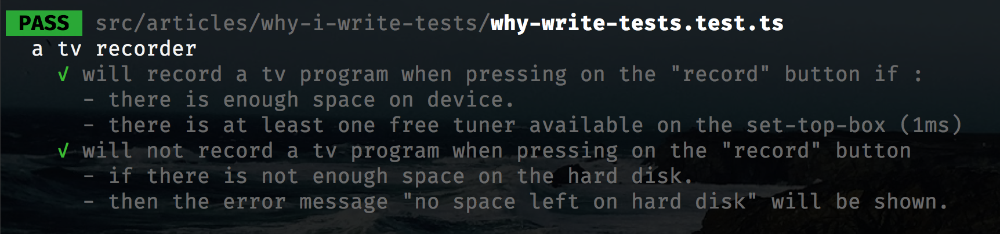

**Do you write automated tests ?**

Are you **enjoying** it ?

In many software development teams, a large amount of people do not like writing tests. This doesn't mean they don't write tests, but they treat this activity as a chore and delay it after implementation. As a result the tests that get written are very often of **lower quality than the production code** they are written against.

This is sad and has many **downsides**:

- This makes **writing tests** feel **less attractive** to people as the current tests are of lower quality.
- This makes **improving tests** feel **less attractive** too.
- This makes **bugfixing more difficult**, as it's more difficult to step in the test suites, it's a lot harder to write a test case that reproduce the issue.
- All in all, this contributes to **a vicious circle** where as writing and maintaining tests is seen as a chore, tests are of poor quality.

For most people, automated tests are seen as a way to reach **quality assurance**. Automated tests are indeed **a net to prevent mistakes and defects**. And it will work not only on what we build now, but also in what we will build in the future to **avoid regressions**.

While this is a very valid reason, this is not the only one reason why I write tests, I will present you the many reasons I write automated tests.

## Tests guide me

Very often when working on a feature or a complex defect to fix, I usually write all use cases I have in mind using a full sentence as a test name and an empty code block as an implementation.

`embed:why-i-write-tests/todos.test.ts`

This allows me to list all use cases I have in mind when beginning work. It makes the work way less intimidating.

After that I can start implementing each use case one by one. I will at some point add more tests as the initial lists was probably incomplete. I can also see how much progress I've made so far as if it was a todo list.

## Tests help me focus on one thing at a time

As a software engineer, I very often tend to have many ideas at the same time. While this is very exciting, sometimes I can be tempted to solve two problems at a time for instance :

- Implementing the feature I'm working on.
-

## Tests document how the product I'm building should behave

I can easily describe with sentences how the software product I'm writing should behave.

`embed:why-i-write-tests/bdd.test.ts`

I'm using the [template literals](https://developer.mozilla.org/en-US/docs/Web/JavaScript/Reference/Template_literals) ES feature, this allows me to use multiple line sentences with bullet points in tests descriptions.

When running the tests, I get the following readable report :

This way I can write complete sentences explaining how the product should behave. This technique ressembles to [behavior-driven development](https://en.wikipedia.org/wiki/Behavior-driven_development) in a way that it provides exemples on how the application should behave.

However, these sentences are not executable specifications such as [cucumber](https://cucumber.io/), [jgiven](http://jgiven.org/) or [jsgiven](https://jsgiven.org/). In executable specifications, the scenario is executed, here we just give sentences to describe our product, but it still gives tests more sense.

## Tests make sure I can change what I'm building

## Tests make sure I can deploy software at any given time

## To sum up
